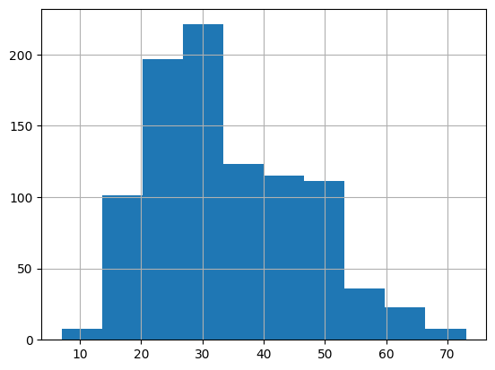
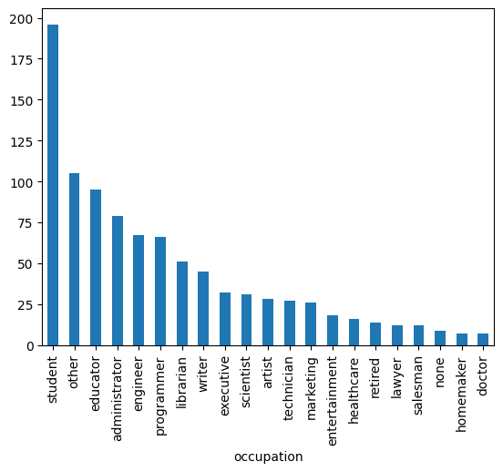
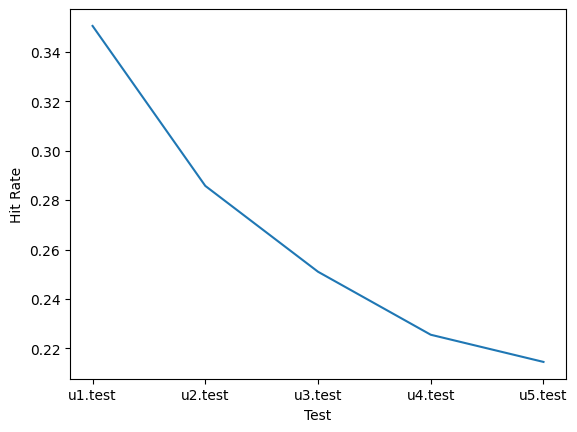
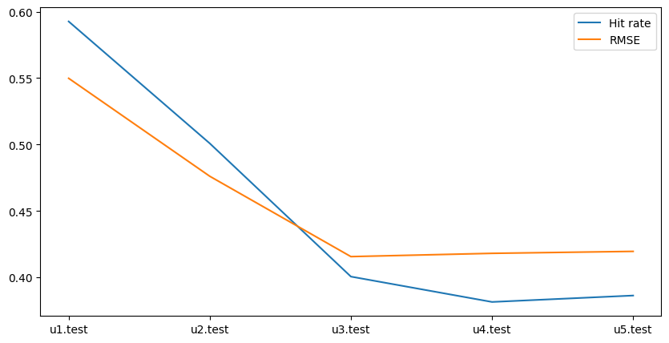

# Assignment 2: Final report
Author:
- Ivan Chernakov
- BS21-DS-02
- i.chernakov@innopolis.university

## Table of contents
- [Assignment 2: Final report](#assignment-2-final-report)
  - [Table of contents](#table-of-contents)
  - [Introduction](#introduction)
  - [Data analysis](#data-analysis)
  - [Models Implementation](#model-mplementation)
    - [ALS](#als)
    - [KNN with TF-IDF](#knn-with-tf-idf)
  - [Models Advantages and Disadvantages](#model-advantages-and-disadvantages)
    - [ALS](#als-1)
    - [KNN with TF-IDF](#knn-with-tf-idf-1)
  - [Evaluation](#evaluation)
  - [Conclusion](#conclusion)

## Introduction
The main goal of assignment is in implementation Recommendation System model on [MovieLens 100K dataset](https://grouplens.org/datasets/movielens/100k/). I did not want to try out heavy solution like LightGCN or NGCN, so I decided to implement two simple models: ALS and KNN with TF-IDF. I will describe them in details in the next sections.

## Data analysis
First of all, I want to describe the dataset. It contains 100k ratings from 943 users on 1682 movies.
The initial idea was to use user's features like gender, age, zipcode and their occupation.
The age distribution is shown below:

As we can see, the most of users are in the range from 20 to 40 years old. 
The occupation histogram is shown below:

The most popular one is a student.

Also I found out that on whole dataset with 943 users there only 795 unique zipcodes, so I was sure that this feature is irrelevant.

## Models Implementation
### ALS
The first model I implemented was Alternate Least Squares. The overall approach was guied by this [tutorial](https://www.kaggle.com/code/pauloyuncha/recommendation-system-from-zero-to-hero-2?scriptVersionId=123152617). The main idea in ALS model is "ALS is an iterative optimization process where we for every iteration try to arrive closer and closer to a factorized representation of our original data." ([article](https://medium.com/radon-dev/als-implicit-collaborative-filtering-5ed653ba39fe)). 

The main steps of ALS algorithm are:
1. Initialize user and item factors with random values
2. Fix user factors and solve for item factors
3. Fix item factors and solve for user factors
4. Repeat 2 and 3 until convergence or for a fixed number of iterations

(The picture is taken from [here](https://russianblogs.com/article/18711021477/))

### KNN with TF-IDF
The second model I implemented was KNN with TF-IDF. The main idea is to use TF-IDF to find the most similar movies to the one user liked. The main steps are:
1. Calculate TF-IDF for each movie
2. Calculate cosine similarity between movies
3. Find the most similar movies to the one user liked
4. Recommend the most similar movies

## Models Advantages and Disadvantages
Both models have similar advantages and disadvantages.
Advantages:
- Easy to implement
- Fast to train

Disadvantages:
- Cannot handle cold start problem
- Cannot handle new users and new items

Also both models in my implementation are very naive and can be improved in many ways (so the metrics are not very good).

## Evaluation
Speaking of metrics, I used two of them: RMSE and Hit rate. RMSE is a standard metric for recommendation systems. Hit rate is a metric that shows how many times the model recommended the movie that user actually liked. The results are shown below:
### ALS

On ALS I used only Hit Rate metric. The value depends onlu on the size of recommended movies list. I tried recoommending from 20 to 500 movies, because I do not really understand what is the optimal number of recommendations. Some sites can recommend up to hundreds diffrent contents, but some of them recommend only 5-10. So I decided to try out different values. The best result was achieved with 500 recommended movies.

Also, the evaluation was done on the partitions of dataset from u1 to u5. 
### KNN with TF-IDF

On KNN I used both metrics. The best result was achieved with 20 recommended movies per user. The evaluation was done on the same partitions as ALS.

The results are a lot better than I expected. I think it is because of the small dataset or the fact that I do not differentiate between good and bad ratings as the evaluation criterias might be debatable. I just recommend the most similar movies. 

## Conclusion
Even though the results are not very objective, I think it was a good experience to implement two simple models. The both models showed relevant results.